  

### Hi, I'm Rowan! 👋

I'm currently the Platform Development Lead for automation capabilities @
[Interactive](https://www.interactive.com.au) and based in Brisbane, Australia
🇦🇺&puncsp;. My role currently oversees a DevOps engineering practice that
designs, develops and deploys middleware to make technology more human for our
people and our customers.

Previously I've consulted at many large businesses, education providers and
government agencies to optimise, design and deploy top-tier data management
solutions built on [Commvault](https://www.commvault.com/)'s Intelligent Data
Services.

I'm passionate about understanding how DevOps and Infrastructure-as-Code fit
into a modern and progressive business and keep myself busy in my downtime,
continuing to learn about:

- 🗃&ensp;Git and Semantic versioning
- 🚂&ensp;Continuous Integration/Development in Web Development
- 🛳&ensp;Docker and Kubernetes in a micro-service context
- 🕸&ensp;Service Mesh's in traditional infrastructure
- 🛠&ensp;Ansible as a robust provisioning toolset

#### 🤝🏻&ensp;You can find me here:

- Telegram: [@r0b0tn11k](https://t.me/r0b0tn11k "My Telegram")
- LinkedIn:
  [rowangillson](https://www.linkedin.com/in/rowangillson/ "My LinkedIn Profile")

#### 📈&ensp;GitHub Stats

  

  
  
  
  

  

<!--
**arrrgi/arrrgi** is a ✨ _special_ ✨ repository because its `README.md` (this file) appears on your GitHub profile.

Here are some ideas to get you started:

- 🔭 I’m currently working on ...
- 🌱 I’m currently learning ...
- 👯 I’m looking to collaborate on ...
- 🤔 I’m looking for help with ...
- 💬 Ask me about ...
- 📫 How to reach me: ...
- 😄 Pronouns: ...
- ⚡ Fun fact: ...
-->
